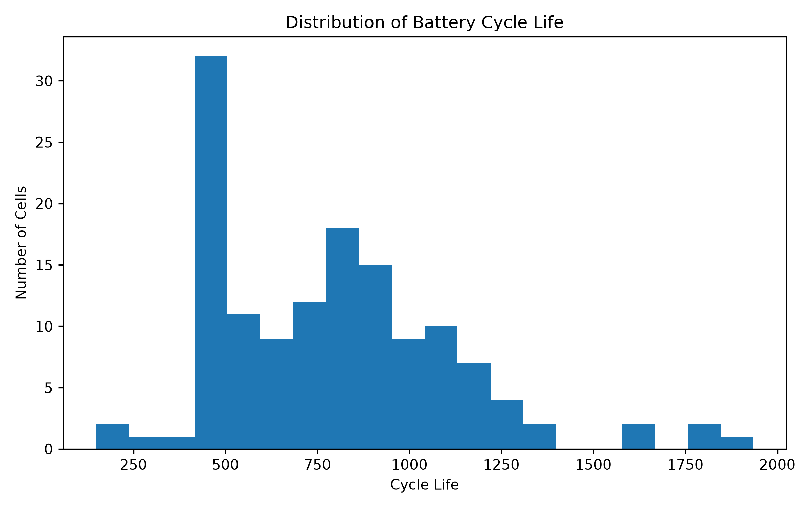
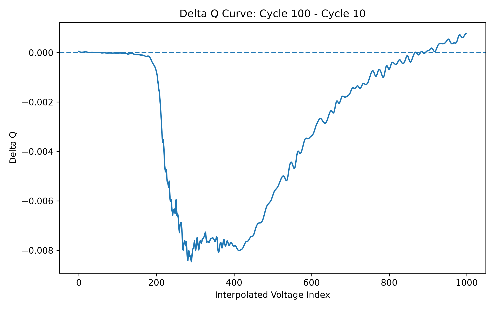
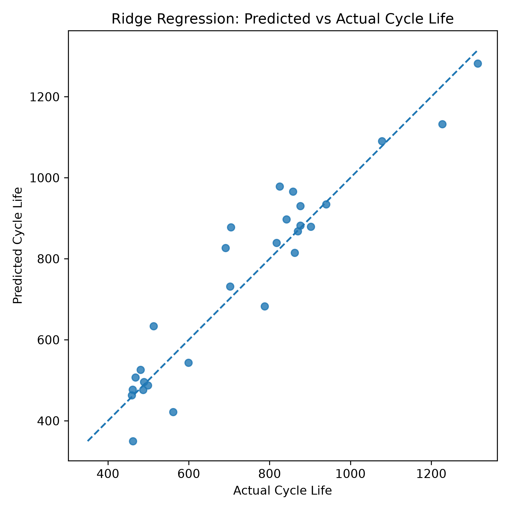
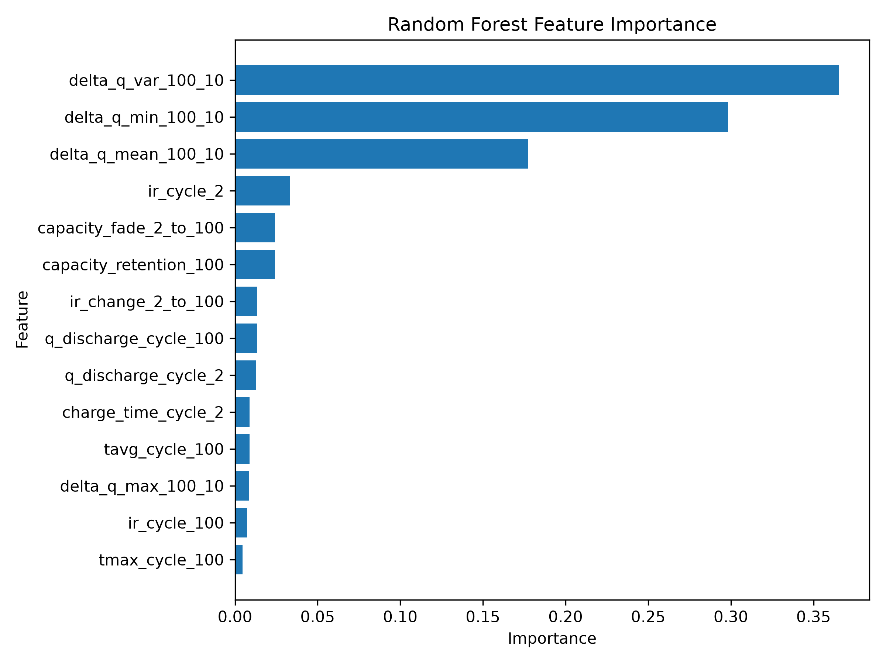

# Early Prediction of Lithium-Ion Battery Lifetime Using Physics-Informed Machine Learning

This project uses the MIT-Stanford-Toyota battery dataset to predict lithium-ion battery cycle life from early-cycle electrochemical data.

The goal is to test whether features extracted from the first 100 cycles can predict long-term battery degradation, with special emphasis on physics-informed features derived from changes in the discharge capacity curve.

## Project Motivation

Battery cycle-life testing can take months or years because cells often need to be cycled until they reach an end-of-life capacity threshold. Early lifetime prediction can help accelerate battery research, fast-charging optimization, and degradation analysis.

This project explores whether machine learning models can predict final cycle life using only early-cycle data.

## Dataset

The dataset contains commercial lithium iron phosphate (LFP)/graphite cells cycled under fast-charging conditions. The raw data is provided as MATLAB `.mat` files containing per-cycle measurements such as discharge capacity, internal resistance, temperature, charge time, and voltage/capacity curves.

Raw data files are not included in this repository. To reproduce the project, download the structured batch files from the Toyota Research Institute dataset page and place them in `data/raw/`:

```text
data/raw/2017-05-12_batchdata_updated_struct_errorcorrect.mat
data/raw/2017-06-30_batchdata_updated_struct_errorcorrect.mat
data/raw/2018-04-12_batchdata_updated_struct_errorcorrect.mat
```

## Current Features

The current feature table includes early-cycle summary features such as:

- discharge capacity at cycle 2 and cycle 100
- capacity fade from cycle 2 to cycle 100
- capacity retention at cycle 100
- internal resistance at cycle 2 and cycle 100
- internal resistance change from cycle 2 to cycle 100
- charge time at cycle 2
- average and maximum temperature at cycle 100

The project also includes Delta Q features computed from the difference between interpolated discharge capacity curves:

```text
Delta Q = Qdlin(cycle 100) - Qdlin(cycle 10)
```

These features summarize how the discharge curve changes early in the battery's lifetime.

## Initial Model Results

### Holdout Test Set

| Model | MAE cycles | RMSE cycles | R² |
|---|---:|---:|---:|
| Dummy Mean Baseline | 197.66 | 243.02 | -0.084 |
| Ridge Regression | 57.94 | 77.71 | 0.889 |
| Random Forest | 66.80 | 108.31 | 0.785 |

### 5-Fold Cross-Validation

| Model | MAE cycles | RMSE cycles | R² |
|---|---:|---:|---:|
| Ridge Regression | 108.12 | 169.52 | 0.707 |
| Random Forest | 97.78 | 145.99 | 0.775 |

The holdout split suggests that Ridge Regression performs best on one specific train/test split. However, 5-fold cross-validation gives a more robust estimate of model performance and shows that Random Forest performs slightly better on average.

This distinction is important because the dataset is small, so a single train/test split can make one model look better than it may be across different splits.

## Key Finding So Far

Random Forest feature importance shows that the most important predictors are Delta Q features, especially:

1. `delta_q_var_100_10`
2. `delta_q_min_100_10`
3. `delta_q_mean_100_10`

This supports the idea that early changes in discharge curve shape contain predictive information about long-term battery degradation.

The Ridge Regression coefficient analysis also shows that Delta Q features are among the strongest predictors after standardization. In particular, `delta_q_min_100_10`, `delta_q_var_100_10`, and `delta_q_mean_100_10` have large coefficient magnitudes, suggesting that early shifts in the discharge-capacity curve are strongly associated with predicted cycle life.

Because Ridge Regression was used inside a pipeline with `StandardScaler`, the coefficient magnitudes are comparable across features. Positive coefficients indicate features associated with longer predicted cycle life, while negative coefficients indicate features associated with shorter predicted cycle life.

## Limitations

This project should be interpreted as a reproducible machine learning case study, not as a universal battery lifetime predictor.

Current limitations include:

- the dataset uses one battery chemistry: LFP/graphite cells
- the cells were tested under specific fast-charging protocols
- the dataset is relatively small for machine learning
- model performance may vary depending on the train/test split
- features are extracted only from this structured dataset format
- the model has not yet been validated on other battery chemistries or cycling conditions

These limitations are important because battery degradation depends strongly on chemistry, temperature, charging protocol, cell design, and operating conditions.


## Visual Results

### Cycle Life Distribution



### Delta Q Curve Example



### Predicted vs Actual Cycle Life



### Random Forest Feature Importance



## Repository Structure

```text
battery-lifetime-prediction/
├── app/
├── data/
│   ├── raw/
│   └── processed/
├── notebooks/
├── reports/
│   └── figures/
├── src/
│   ├── data_loader.py
│   ├── features.py
│   ├── models.py
│   └── visualization.py
├── README.md
├── requirements.txt
└── .gitignore
```

## How to Run

Create and activate a virtual environment:

```bash
python3 -m venv .venv
source .venv/bin/activate
```

Install dependencies:

```bash
pip install -r requirements.txt
```

Generate the feature table:

```bash
python src/data_loader.py
```

Train models and save results:

```bash
python src/models.py
```

Generate visualizations:

```bash
python src/visualization.py
```

## Citation

This project uses the MIT-Stanford-Toyota battery degradation dataset associated with:

Severson, K. A., Attia, P. M., Jin, N., Perkins, N., Jiang, B., Yang, Z., Chen, M. H., Aykol, M., Herring, P. K., Fraggedakis, D., Bazant, M. Z., Harris, S. J., Chueh, W. C., & Braatz, R. D. (2019). Data-driven prediction of battery cycle life before capacity degradation. *Nature Energy*, 4, 383–391.

The raw dataset is not redistributed in this repository. Users should download it from the official Toyota Research Institute dataset page.

## Current Status

Completed:

- loaded all three raw structured dataset batches
- extracted valid cycle-life labels
- handled missing cycle-life values
- engineered early-cycle summary features
- engineered Delta Q features from cycles 10 and 100
- trained Dummy, Ridge Regression, and Random Forest models
- evaluated models using holdout testing and 5-fold cross-validation
- generated model comparison results
- generated predicted-vs-actual plot
- generated Delta Q curve visualization
- generated Random Forest feature importance plot
- generated Ridge coefficient table

Next steps:

- add ElasticNet as another regularized linear model
- optionally build a Streamlit dashboard
